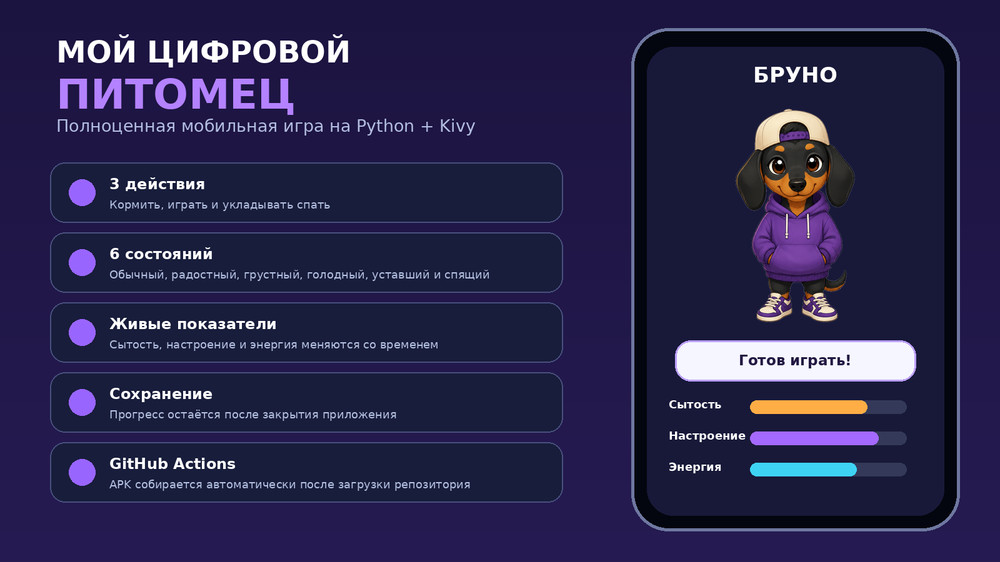

# Мой цифровой питомец



Готовая мобильная игра-тамагочи на Python и Kivy. Репозиторий уже содержит исходный код, изображения персонажа, тесты, настройки Buildozer и GitHub Actions для автоматической сборки установочного APK.

## Что умеет игра

- кормить питомца, играть с ним и укладывать его спать;
- отслеживать сытость, настроение и энергию;
- менять изображение персонажа в шести состояниях;
- понемногу снижать показатели по таймеру;
- выдавать награду, когда все показатели подняты до 80;
- сохранять прогресс после закрытия приложения;
- менять имя питомца и сбрасывать игру через настройки.

## Самый простой способ получить APK через GitHub

1. Создайте на GitHub пустой репозиторий. Лучше назвать его `digital-pet`.
2. Распакуйте ZIP с проектом на компьютере.
3. Загрузите **содержимое** папки проекта в корень репозитория. В корне должны быть видны `main.py`, `game_logic.py`, `buildozer.spec`, папки `assets` и `.github`.
4. Нажмите `Commit changes` и сохраните файлы в ветку `main`.
5. Откройте вкладку `Actions`. Workflow `Build Android APK` запустится автоматически.
6. Дождитесь зелёной галочки. Первая сборка обычно длится заметно дольше следующих, потому что GitHub скачивает Android SDK и NDK.
7. Откройте завершённый запуск и скачайте в разделе `Artifacts` архив `digital-pet-apk`.
8. Распакуйте архив. Внутри находится установочный файл `digital-pet-...-debug.apk`.

Если автоматический запуск не начался, откройте `Actions` → `Build Android APK` → `Run workflow`.

## Что происходит в GitHub Actions

Workflow выполняет четыре этапа:

1. Проверяет синтаксис Python.
2. Запускает автоматические тесты игровой логики.
3. Собирает APK через Buildozer 1.6.0 и python-for-android v2026.05.09.
4. Загружает APK и файл контрольной суммы SHA-256 как artifact.

При отправке тега вида `v1.0.0` тот же APK дополнительно публикуется во вкладке `Releases`.

## Запуск на компьютере

```bash
python -m venv .venv
```

Windows:

```bash
.venv\Scripts\activate
python -m pip install -r requirements-desktop.txt
python main.py
```

Linux или macOS:

```bash
source .venv/bin/activate
python -m pip install -r requirements-desktop.txt
python main.py
```

## Где менять игру

### Имя и стартовые характеристики

Файл `game_logic.py`, класс `PetModel`:

```python
name: str = "Бруно"
satiety: int = 50
mood: int = 50
energy: int = 50
```

### Правила кнопок

В том же файле находятся методы:

- `feed()`;
- `play()`;
- `start_sleep()` и `finish_sleep()`;
- `passive_tick()`.

### Изображения

Файлы находятся в папке `assets`:

- `pet_normal.png`;
- `pet_happy.png`;
- `pet_sad.png`;
- `pet_hungry.png`;
- `pet_tired.png`;
- `pet_sleep.png`.

Можно заменить картинку, сохранив прежнее название файла. Желательно использовать PNG с прозрачным фоном и квадратный холст.

### Цвета и интерфейс

Палитра находится в начале `main.py` в словаре `COLORS`. Основной экран собирается в классе `DigitalPetRoot`.

## Структура репозитория

```text
.
├── .github/
│   └── workflows/
│       └── build-apk.yml
├── assets/
│   ├── icon.png
│   ├── presplash.png
│   ├── pet_normal.png
│   ├── pet_happy.png
│   ├── pet_sad.png
│   ├── pet_hungry.png
│   ├── pet_tired.png
│   └── pet_sleep.png
├── docs/
│   └── preview.png
├── tests/
│   └── test_game_logic.py
├── buildozer.spec
├── game_logic.py
├── main.py
└── requirements-desktop.txt
```

## Важно

Собираемый workflow-файл создаёт **debug APK**. Он подходит для установки на телефоны, тестирования и учебной демонстрации. Для публикации в Google Play понадобится подписанный AAB и безопасное хранение ключа подписи в GitHub Secrets.

## Проверка тестов локально

```bash
python -m unittest discover -s tests -v
```
